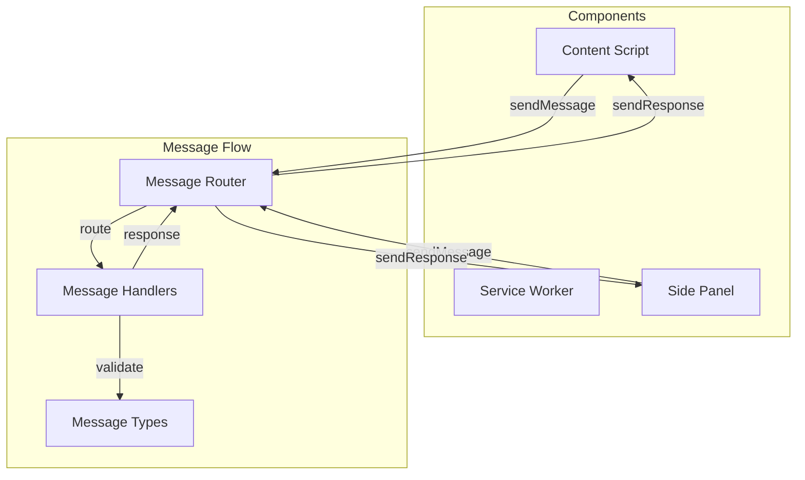
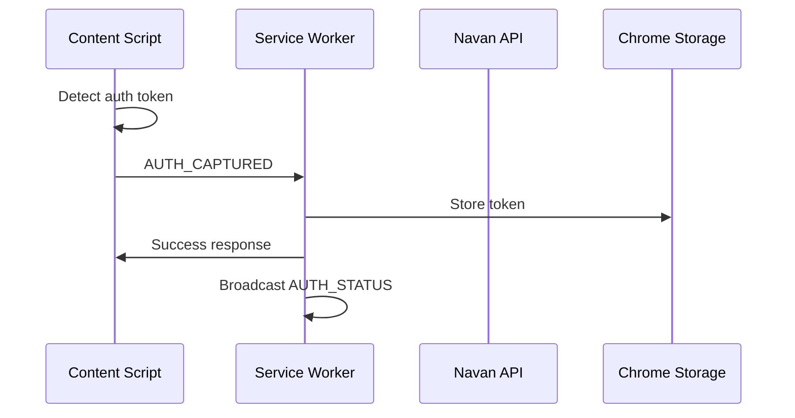
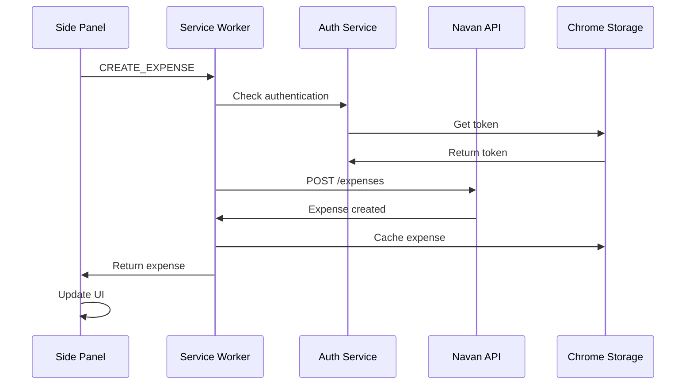

# Messaging System Documentation

The Expensabl extension uses a robust, type-safe messaging system for communication between different components (content script, service worker, and side panel).

## Overview



## Message Architecture

### Message Structure

Every message follows a standard structure:

```typescript
interface Message<T = any> {
  type: string;           // Message type identifier
  payload?: T;            // Optional payload data
  metadata?: {
    timestamp: number;    // When message was created
    source: string;       // Component that sent it
    requestId?: string;   // For request/response correlation
  };
}
```

### Message Types

All message types are defined in a central location:

```typescript
// src/features/messaging/types.ts

// Authentication Messages
export interface AuthCapturedMessage {
  type: 'AUTH_CAPTURED';
  payload: {
    token: string;
    expiresAt?: number;
  };
}

export interface AuthStatusMessage {
  type: 'AUTH_STATUS';
  payload: {
    isAuthenticated: boolean;
    expiresAt?: number;
  };
}

// Expense Messages
export interface FetchExpensesMessage {
  type: 'FETCH_EXPENSES';
  payload?: {
    startDate?: string;
    endDate?: string;
    status?: ExpenseStatus;
  };
}

export interface CreateExpenseMessage {
  type: 'CREATE_EXPENSE';
  payload: {
    merchant: string;
    amount: number;
    currency: string;
    description?: string;
    category?: string;
  };
}

// Template Messages
export interface CreateTemplateMessage {
  type: 'CREATE_TEMPLATE';
  payload: {
    name: string;
    expenseData: Partial<Expense>;
  };
}

export interface ScheduleTemplateMessage {
  type: 'SCHEDULE_TEMPLATE';
  payload: {
    templateId: string;
    schedule: ScheduleConfig;
  };
}

// Union type of all messages
export type AppMessage = 
  | AuthCapturedMessage
  | AuthStatusMessage
  | FetchExpensesMessage
  | CreateExpenseMessage
  | CreateTemplateMessage
  | ScheduleTemplateMessage;
```

## Message Router Implementation

### Core Router

```typescript
// src/features/messaging/router.ts
export class MessageRouter {
  private handlers = new Map<string, MessageHandler<any>>();
  private middleware: Middleware[] = [];

  constructor() {
    this.setupListener();
  }

  private setupListener() {
    chrome.runtime.onMessage.addListener(
      (message, sender, sendResponse) => {
        this.handleMessage(message, sender)
          .then(sendResponse)
          .catch(error => {
            sendResponse({ error: error.message });
          });
        return true; // Keep channel open for async response
      }
    );
  }

  register<T extends AppMessage>(
    type: T['type'],
    handler: MessageHandler<T>
  ) {
    this.handlers.set(type, handler);
  }

  use(middleware: Middleware) {
    this.middleware.push(middleware);
  }

  private async handleMessage(
    message: AppMessage,
    sender: chrome.runtime.MessageSender
  ): Promise<any> {
    // Run middleware
    for (const mw of this.middleware) {
      const result = await mw(message, sender);
      if (result === false) {
        throw new Error('Message blocked by middleware');
      }
    }

    // Find and execute handler
    const handler = this.handlers.get(message.type);
    if (!handler) {
      throw new Error(`No handler for message type: ${message.type}`);
    }

    return handler(message, sender);
  }
}
```

### Message Handler Type

```typescript
export type MessageHandler<T extends AppMessage> = (
  message: T,
  sender: chrome.runtime.MessageSender
) => Promise<any> | any;

export type Middleware = (
  message: AppMessage,
  sender: chrome.runtime.MessageSender
) => Promise<boolean | void> | boolean | void;
```

## Usage Examples

### 1. Registering Handlers (Service Worker)

```typescript
// src/chrome/service-worker.ts
import { MessageRouter } from '../features/messaging/router';
import { expenseHandlers } from '../features/expenses/handlers';
import { authHandlers } from '../features/auth/handlers';
import { templateHandlers } from '../features/templates/handlers';

const router = new MessageRouter();

// Register authentication handlers
router.register('AUTH_CAPTURED', authHandlers.handleAuthCaptured);
router.register('AUTH_STATUS', authHandlers.handleAuthStatus);

// Register expense handlers
router.register('FETCH_EXPENSES', expenseHandlers.handleFetchExpenses);
router.register('CREATE_EXPENSE', expenseHandlers.handleCreateExpense);

// Register template handlers
router.register('CREATE_TEMPLATE', templateHandlers.handleCreateTemplate);
router.register('SCHEDULE_TEMPLATE', templateHandlers.handleScheduleTemplate);

// Add logging middleware
router.use(async (message, sender) => {
  console.log(`[Message] ${message.type} from ${sender.url}`);
  return true; // Continue processing
});
```

### 2. Sending Messages (Content Script)

```typescript
// src/chrome/content.ts
import { sendMessage } from '../features/messaging/client';

// Capture auth token
const captureAuthToken = (token: string) => {
  sendMessage<AuthCapturedMessage>({
    type: 'AUTH_CAPTURED',
    payload: { token }
  });
};

// With response handling
const fetchExpenses = async () => {
  try {
    const response = await sendMessage<FetchExpensesMessage>({
      type: 'FETCH_EXPENSES',
      payload: {
        startDate: '2024-01-01',
        endDate: '2024-12-31'
      }
    });
    console.log('Expenses:', response.expenses);
  } catch (error) {
    console.error('Failed to fetch expenses:', error);
  }
};
```

### 3. Sending Messages (Side Panel)

```typescript
// src/chrome/sidepanel.ts
import { MessageClient } from '../features/messaging/client';

const client = new MessageClient();

// Create expense
const createExpense = async (data: ExpenseFormData) => {
  const response = await client.send<CreateExpenseMessage>({
    type: 'CREATE_EXPENSE',
    payload: {
      merchant: data.merchant,
      amount: parseFloat(data.amount),
      currency: data.currency,
      description: data.description
    }
  });

  if (response.error) {
    showError(response.error);
  } else {
    showSuccess('Expense created successfully');
    refreshExpenseList();
  }
};
```

## Message Client Implementation

```typescript
// src/features/messaging/client.ts
export class MessageClient {
  private requestId = 0;

  async send<T extends AppMessage>(
    message: T
  ): Promise<any> {
    return new Promise((resolve, reject) => {
      const metadata = {
        timestamp: Date.now(),
        source: this.getSource(),
        requestId: `${this.requestId++}`
      };

      chrome.runtime.sendMessage(
        { ...message, metadata },
        (response) => {
          if (chrome.runtime.lastError) {
            reject(new Error(chrome.runtime.lastError.message));
          } else if (response?.error) {
            reject(new Error(response.error));
          } else {
            resolve(response);
          }
        }
      );
    });
  }

  private getSource(): string {
    if (typeof window === 'undefined') {
      return 'service-worker';
    }
    return window.location.href.includes('sidepanel.html') 
      ? 'side-panel' 
      : 'content-script';
  }
}

// Convenience function
export const sendMessage = <T extends AppMessage>(
  message: T
): Promise<any> => {
  const client = new MessageClient();
  return client.send(message);
};
```

## Handler Implementation Examples

### Auth Handler

```typescript
// src/features/auth/handlers/auth.handler.ts
export const handleAuthCaptured = async (
  message: AuthCapturedMessage,
  sender: chrome.runtime.MessageSender
): Promise<{ success: boolean }> => {
  const authService = container.get(AuthService);
  
  try {
    await authService.storeToken(message.payload.token);
    
    // Broadcast auth status update
    broadcastMessage({
      type: 'AUTH_STATUS',
      payload: {
        isAuthenticated: true,
        expiresAt: message.payload.expiresAt
      }
    });
    
    return { success: true };
  } catch (error) {
    logger.error('Failed to store auth token', error);
    throw error;
  }
};
```

### Expense Handler

```typescript
// src/features/expenses/handlers/expense.handler.ts
export const handleFetchExpenses = async (
  message: FetchExpensesMessage,
  sender: chrome.runtime.MessageSender
): Promise<{ expenses: Expense[] }> => {
  const expenseService = container.get(ExpenseService);
  
  try {
    const filters = message.payload || {};
    const expenses = await expenseService.fetchExpenses(filters);
    
    return { expenses };
  } catch (error) {
    if (error.code === 'AUTH_REQUIRED') {
      // Request auth refresh
      await sendMessage({ type: 'AUTH_REFRESH' });
      // Retry
      return handleFetchExpenses(message, sender);
    }
    throw error;
  }
};
```

## Broadcasting Messages

For one-to-many communication:

```typescript
// src/features/messaging/broadcast.ts
export const broadcastMessage = async (
  message: AppMessage
): Promise<void> => {
  // Send to all tabs
  const tabs = await chrome.tabs.query({});
  for (const tab of tabs) {
    if (tab.id) {
      chrome.tabs.sendMessage(tab.id, message).catch(() => {
        // Tab might not have content script
      });
    }
  }

  // Send to side panel if open
  chrome.runtime.sendMessage(message).catch(() => {
    // Side panel might not be open
  });
};
```

## Error Handling

### Structured Error Responses

```typescript
interface ErrorResponse {
  error: string;
  code?: string;
  details?: any;
}

// In handler
export const handleCreateExpense = async (
  message: CreateExpenseMessage
): Promise<{ expense: Expense } | ErrorResponse> => {
  try {
    const expense = await expenseService.create(message.payload);
    return { expense };
  } catch (error) {
    if (error instanceof ValidationError) {
      return {
        error: 'Validation failed',
        code: 'VALIDATION_ERROR',
        details: error.violations
      };
    }
    
    return {
      error: error.message,
      code: 'UNKNOWN_ERROR'
    };
  }
};
```

### Client-side Error Handling

```typescript
const createExpense = async (data: ExpenseData) => {
  try {
    const response = await sendMessage({
      type: 'CREATE_EXPENSE',
      payload: data
    });

    if ('error' in response) {
      handleError(response);
    } else {
      handleSuccess(response.expense);
    }
  } catch (error) {
    // Network or extension error
    console.error('Failed to send message:', error);
  }
};
```

## Middleware System

### Authentication Middleware

```typescript
const authMiddleware: Middleware = async (message, sender) => {
  // Skip auth check for auth messages
  if (message.type.startsWith('AUTH_')) {
    return true;
  }

  const authService = container.get(AuthService);
  const isAuthenticated = await authService.isAuthenticated();

  if (!isAuthenticated) {
    throw new Error('Authentication required');
  }

  return true;
};

router.use(authMiddleware);
```

### Logging Middleware

```typescript
const loggingMiddleware: Middleware = async (message, sender) => {
  const logger = new Logger('MessageRouter');
  
  logger.info('Message received', {
    type: message.type,
    source: sender.url || 'unknown',
    timestamp: message.metadata?.timestamp
  });

  const startTime = performance.now();

  // Continue processing
  return true;
};
```

## Testing Messages

### Mock Message Router

```typescript
// test-utils/mock-router.ts
export class MockMessageRouter {
  private handlers = new Map<string, Function>();

  register(type: string, handler: Function) {
    this.handlers.set(type, handler);
  }

  async simulateMessage(message: AppMessage) {
    const handler = this.handlers.get(message.type);
    if (!handler) {
      throw new Error(`No handler for ${message.type}`);
    }
    return handler(message, { url: 'mock://test' });
  }
}
```

### Testing Handlers

```typescript
describe('ExpenseHandler', () => {
  let router: MockMessageRouter;
  let expenseService: jest.Mocked<ExpenseService>;

  beforeEach(() => {
    router = new MockMessageRouter();
    expenseService = createMockExpenseService();
    
    router.register('CREATE_EXPENSE', handleCreateExpense);
  });

  test('should create expense', async () => {
    const message: CreateExpenseMessage = {
      type: 'CREATE_EXPENSE',
      payload: {
        merchant: 'Test',
        amount: 100,
        currency: 'USD'
      }
    };

    expenseService.create.mockResolvedValue(mockExpense);

    const response = await router.simulateMessage(message);
    
    expect(response.expense).toEqual(mockExpense);
    expect(expenseService.create).toHaveBeenCalledWith(message.payload);
  });
});
```

## Best Practices

### 1. Type Safety
- Always define message types in the central types file
- Use TypeScript discriminated unions for message types
- Validate payloads at runtime

### 2. Error Handling
- Always return structured error responses
- Use error codes for programmatic handling
- Log errors with context

### 3. Performance
- Keep message payloads small
- Use pagination for large data sets
- Implement request debouncing

### 4. Security
- Validate sender origin for sensitive operations
- Sanitize all inputs from content scripts
- Never expose sensitive data in messages

### 5. Debugging
- Use meaningful message type names
- Include metadata for tracing
- Log all messages in development mode

## Message Flow Diagrams

### Authentication Flow



### Expense Creation Flow


